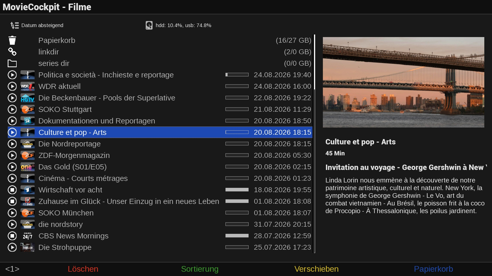

# MovieCockpit (MVC)



## Features
- MVC is a movie list plugin for Open Enigma2 settop boxes (OpenViX and compatible distributions).
- MVC implements a permanent sqlite movie cache which allows MVC to display the movie list with all its information without disk access. So, no spinners or delays due to disk spinup.
- MVC imports all movies located in the E2 movie directories, which can be located on multiple physical disks.
- MVC implements exact event start time and duration rather than recording start time and duration which includes margins before and after the event.
- MVC provides various options to configure the skin to your liking.
- MVC provides a smart jump function that conventiently allows to skip advertisements using the bouquet keys by adapting the skip distance automatically.
- MVC provides a manual/automatic backup function that allows to record movies to an internal disk and then move it to external backup media (USB/NAS).
- MVC uses the plugin MountCockpit that dynamically recognizes and mounts network drives powering on/off.
- MVC supports various sources for "video artwork" especially tailored to tv recordings.
- MVC supports individual covers for movies ```<movie filename>.jpg``` and common covers for all movies in a directory ```<directory>.jpg```.
- MVC supports series folders: recordings will be added to the appropriate folder automagically.
- MVC supports unique sorting by folders.

## Disclaimer
The project author is not responsible for how this software is used by others. It is not intended to be used for accessing or distributing copyrighted materials without authorization.
Users are solely responsible for determining the legality of their actions.

This repository has no control over the streams, links, or the legality of the content provided by the different hosts (including all mirror sites). It is the end user's responsibility to ensure the legal use of these streams, and we strongly recommend verifying that the content complies with all applicable laws, including copyright laws and regulations of your country's jurisdiction before use.

## Limitations
- Tested on OpenViX and OpenATV with DM900.

## Links
- Installation: https://xcentaurix.github.io/MovieCockpit
